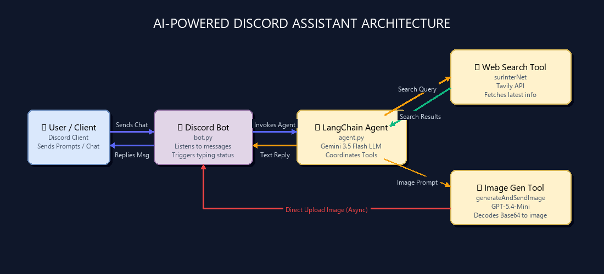

# 1. Project Flow Diagram (Horizontal Block Flow)

The following Mermaid diagram shows the flow of data and execution. It contains the **User (Actor)** and **Discord Client / Tools (Service)** symbols, displaying the process from left to right.



<details>
<summary>💻 Click to expand Mermaid Fallback Diagram</summary>

```mermaid
graph LR
    User["👤 User / Client"] -->|1. Sends Message| Bot["💬 Discord Bot<br/>(bot.py)"]
    Bot -->|2. Invokes Agent (ainvoke)| Agent["🤖 LangChain Agent<br/>(gemini-3.5-flash)"]
    
    Agent -->|3a. Trigger Search| Tavily["🔍 surInterNet Tool<br/>(Tavily Web Search)"]
    Tavily -.->|4a. Return Search Results| Agent
    
    Agent -->|3b. Trigger Gen| ImageGen["🎨 Image Gen Tool<br/>(generateAndSendImage)"]
    ImageGen -.->|4b. Direct Upload File| Bot
    
    Agent -.->|5. Send Text Reply| Bot
    Bot -.->|6. Final Response| User

    style User fill:#dae8fc,stroke:#6c8ebf,stroke-width:2px,color:#000
    style Bot fill:#e1d5e7,stroke:#9673a6,stroke-width:2px,color:#000
    style Agent fill:#fff2cc,stroke:#d6b656,stroke-width:2px,color:#000
    style Tavily fill:#fff2cc,stroke:#d6b656,stroke-width:2px,color:#000
    style ImageGen fill:#fff2cc,stroke:#d6b656,stroke-width:2px,color:#000
```

</details>

### 📈 Interactive draw.io Diagram
We have also included a fully styled edit-ready draw.io diagram file:
- **File Link:** [architecture.drawio](architecture.drawio)
- **Direct Online Viewer:** [Open in diagrams.net / draw.io](https://app.diagrams.net/?showEdit=1&open=https%3A%2F%2Fraw.githubusercontent.com%2Fhsachan295-source%2FAI-Powered-Discord-Assistant%2Fmain%2Farchitecture.drawio)
- **How to edit/view locally:** Download the `architecture.drawio` file, open [draw.io (diagrams.net)](https://app.diagrams.net/), and drag and drop the file onto the canvas to view or modify it.

---

## 🚀 Key Features

1. **Intelligent Conversational Agent:** Powered by `gemini-3.5-flash` via LangChain Google GenAI, allowing the bot to engage in meaningful conversations with users.
2. **Real-time Web Search:** The agent can access current information on the internet through the Tavily Search API.
3. **AI Image Generation:** Generates images on the fly using OpenAI models (`gpt-5.4-mini` / DALL-E wrapper) and uploads the generated files directly back into the Discord channel.
4. **Asynchronous Processing:** Uses Python's `asyncio` and `discord.py` to handle events concurrently, including background image uploading.

---

## 📁 Codebase Structure

The project consists of two core files:

*   **[bot.py](bot.py):** Initializes the Discord client, listens for incoming messages, and passes them to the LangChain Agent.
*   **[agent.py](agent.py):** Defines the LangChain agent configuration, custom tools (`surInterNet` and `generateAndSendImage`), and binds the models.

---

## 🛠️ Setup & Installation

### 1. Prerequisites
Make sure you have **Python 3.10+** installed on your system.

### 2. Install Dependencies
Initialize your virtual environment and install the required libraries:

```bash
# Create virtual environment
python -m venv venv

# Activate virtual environment
# On Windows (PowerShell):
.\venv\Scripts\Activate.ps1
# On Windows (CMD):
.\venv\Scripts\activate.bat
# On macOS/Linux:
source venv/bin/activate

# Install required packages
pip install discord.py python-dotenv langchain-openai langchain-google-genai tavily-python
```

### 3. Environment Variables
Create a `.env` file in the root directory and define the following API keys:

```env
DISCORD_API_KEY=your_discord_bot_token
TAVILY_API_KEY=your_tavily_search_api_key
OPENAI_API_KEY=your_openai_api_key
GOOGLE_API_KEY=your_gemini_api_key
```

### 4. Running the Bot
Once the environment variables are configured and the virtual environment is activated, run:

```bash
python bot.py
```

---

## 🛠️ Detailed Component Interaction

1.  **User Message:** The user types a message in Discord.
2.  **Discord Bot (`bot.py`):** Captures the message event, triggers a typing status (`typing()`), and invokes the agent asynchronously.
3.  **Agent Execution (`agent.py`):** Uses the `gemini-3.5-flash` model to analyze the user prompt.
    *   If it requires recent information, it runs the `surInterNet` tool.
    *   If it requires an image, it runs the `generateAndSendImage` tool, which generates the image, decodes it from Base64, and uploads the file directly to the Discord channel using `asyncio.run_coroutine_threadsafe`.
4.  **Final Response:** The bot sends the textual response from the agent to the Discord channel.
